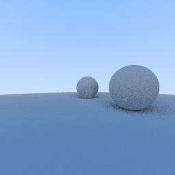

# raycaster-in-het-weekend

## Book
[Ray Tracing in One Weekend (Ray Tracing Mini books Book 1) Kindle Edition](https://www.amazon.com/gp/product/B01B5AODD8/)

## Log by chapters
### Chapter 7. Diffuse material

### Chapter 6. Antialiasing 

### Chapter 5. Display Surface normal as a color 

### Chapter 4. Define Ray class and Sphere

### Chapter 3. Add simple camera and make background

### Chapter 2. Generate PPM image


## Prerequisites
Conan 2.x
CMake >= 3.15

```bash
brew install conan
brew install cmake

conan profile detect --force
conan install . --output-folder=build --build=missing
```

### CLion integration 
Please read and follow instruction https://docs.conan.io/2/integrations/clion.html# to set up the Conan plugin.
Then "Edit Configuration" > "Add new configuration" > "CMake Application"
And enjoy.